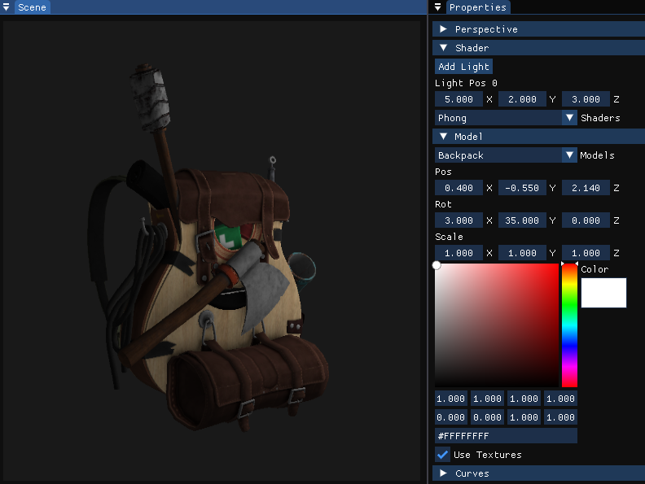
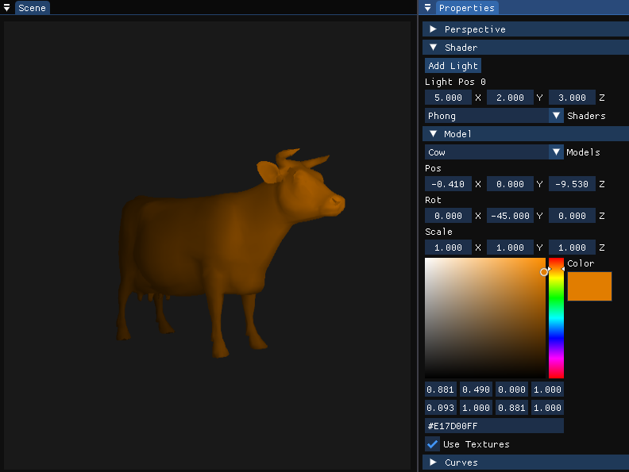
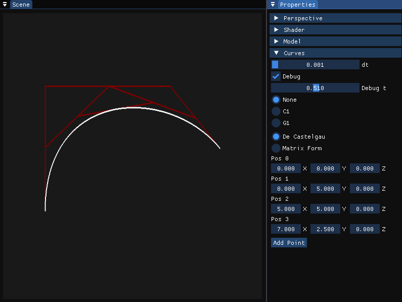

# ModelViewer
This project is a 3D model viewer implemented using OpenGL and ImGui for the user interface. It provides an interactive environment 
to load and view 3D models, with real-time control over shader parameters and lighting. The viewer supports loading models and allows 
users to manipulate their transformations, including translation, rotation, and scaling, to explore the models from different perspectives.

 

 

 

### Build Instructions
1. Clone the repository: `git clone [repository URL]`
2. Navigate to the project directory: `cd ModelViewer`
3. Navigate to the project scripts: `cd scripts`
4. Run the batch script `.\build.bat`
5. Navigate to the build directory and run the executable or run debug script to
open in Visual Studios.

Note: Read through the build batch file and make sure that the path the your Visual Studios directory is the same. If you do not have Visual Studios, then install it. If
the path is different, please modify the path in the batch file for you to run the vcvars64.bat script.

## Controls
Understand how to interact with the ray tracing application using the following controls.

### Keyboard Controls
- **W, A, S, D:** Move object forward, left, backward, and right.
- **Up, Left, Right, and Down Arrows:** Rotates the object.
- **C:** Applies transforms using the CPU.
- **P:** Applies transforms using the GPU.
